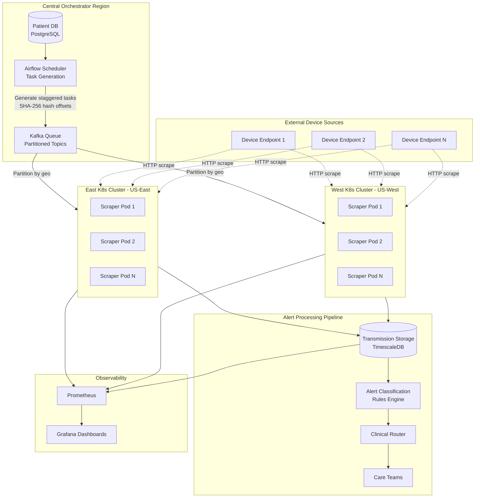

# Architecture Design Document

## Vector Remote Care - Scalable Patient Data Ingestion Pipeline

**Author:** Michael  
**Date:** January 2026  
**Status:** Proposal for 3x Scale Growth (100K → 300K patients)

---

## Executive Summary

This document presents an architecture for scaling Vector's remote patient monitoring data ingestion from 100,000 to 300,000 patients while maintaining clinical accuracy (95% sensitivity) and data freshness (≤5 minutes staleness).

The core innovation is **hashed staggered scheduling** - a deterministic approach that transforms a potentially catastrophic 300,000 QPS burst into a smooth, manageable 1,000 requests/second steady state.

---

## Assumptions & Open Questions

### Scope of This Design

This architecture focuses on the **data ingestion pipeline** - the critical upstream bottleneck for achieving scale. Reliable, timely data ingestion is a prerequisite for downstream alert classification and routing to function correctly.

| In Scope | Out of Scope (Downstream) |
|----------|--------------------------|
| Task scheduling & orchestration | Alert classification rules |
| Scraping execution | Clinical routing logic |
| Multi-region resilience | Notification delivery |
| Transmission data storage | Clinical workflow UI |

### Assumptions Made

| Assumption | Rationale |
|------------|-----------|
| Scraping-based ingestion (no device APIs) | Confirmed with hiring manager - devices upload to vendor portals |
| 5-minute freshness is acceptable clinical SLA | Standard for non-critical vitals monitoring; critical patients may need different tiers |
| **Single missed scrape is acceptable** | Next cycle (5 min later) will fetch data; only consecutive misses are problematic. This simplifies error handling - no complex retry logic within a cycle. |
| ~1KB average transmission size | Typical JSON payload with vitals (heart rate, BP, glucose, SpO2, weight) |
| 5% of transmissions trigger clinical alerts | Industry baseline for anomaly detection in chronic condition monitoring |
| US-based data sources (east/west regions) | Simplifies initial multi-region strategy; international expansion is future work |
| Single cloud provider (AWS) | Multi-cloud adds complexity; single provider sufficient for initial scale |

### Questions for Stakeholders

1. **Priority tiers**: Are there patients requiring faster than 5-minute updates (e.g., post-surgery, recent hospitalization)?
2. **Failure rates**: What is the current scrape failure rate? How often do device vendor schemas/markup change?
3. **Compliance**: What are the specific HIPAA requirements for data retention and audit trails? Is 5-year retention sufficient?
4. **Alert SLA**: What is the acceptable end-to-end latency from data ingestion to clinical alert delivery?
5. **Existing infrastructure**: What message queue/orchestration tools are currently in use? Any constraints on technology choices?
6. **Device diversity**: How many distinct device types/vendors are currently supported? What's the onboarding frequency for new types?

---

## Problem Analysis

### Core Technical Challenge

**Scaling ingestion without compromising freshness (≤5 minutes)**

The current scraping-based ingestion presumably struggles with:
- **Volume**: 100K → 300K patients means millions of daily requests
- **Diversity**: Varying data formats, frequencies, and clinical rules across device types
- **Reliability**: Network flakes, vendor markup changes, rate limiting

This risks:
- Stale data (>5 minutes) → delayed clinical alerts
- Missed alerts (false negatives) → patient safety impact
- System overload → cascading failures

### Critical Failure Modes

| Failure Mode | Impact | Mitigation |
|--------------|--------|------------|
| **Thundering herd** | All scrapes fire simultaneously → queue backlogs, rate limits, IP bans | Hashed staggered scheduling |
| **Regional outages** | Single-region setup → widespread delays/misses | Multi-region K8s clusters with failover |
| **Source changes** | Vendor markup changes → parse failures, data loss | Schema versioning, alerting on parse errors |
| **Burst traffic** | Onboarding spikes or retries → degraded performance | Rate limiting, backpressure, graceful degradation |

Delays cascade to routing/clinical review, eroding trust in a mission-critical healthcare platform.

---

## Scale Assumptions and Capacity Planning

### Input Parameters

| Parameter | Value | Rationale |
|-----------|-------|-----------|
| Patients at scale | 300,000 | 3x growth target over 18 months |
| Scrape interval | 5 min (300s) | Freshness SLA requirement |
| Transmission size | ~1 KB | JSON vitals payload |
| Alert trigger rate | 5% | Estimated anomaly rate |

### Derived Metrics

**QPS Analysis:**
```
Steady-state QPS = 300,000 patients / 300 seconds = 1,000 req/sec

Without staggering (thundering herd):
  All 300K requests in <1 second = 300,000 QPS burst ← CATASTROPHIC

With hashed staggering:
  Requests spread across 300 bins = ~1,000 patients/bin = 1,000 QPS steady ← MANAGEABLE

Peak QPS (2x safety margin) = 2,000 req/sec
```

**Daily Volume:**
```
Transmissions per day = 300K patients × (1440 min / 5 min)
                      = 300K × 288 cycles
                      = 86.4 million transmissions/day

Alerts per day = 86.4M × 5% = 4.32 million alerts/day
Alert QPS = 4.32M / 86,400 sec ≈ 50 alerts/sec
```

**Storage:**
```
Daily storage = 86.4M transmissions × 1KB = 86.4 GB/day
Annual storage = 86.4 GB × 365 = ~31.5 TB/year
5-year retention (healthcare compliance) = ~158 TB

With TimescaleDB compression (3-5x): ~30-50 TB actual
```

**Infrastructure:**
```
Scraper pod capacity = 50 req/sec per pod (conservative)
Minimum pods needed = 1,000 / 50 = 20 pods

With 2 regions + 1.5x redundancy:
  Pods per region = 20 × 1.5 = 30 pods
  Total pods = 60 across east/west

Target SLA = 99.99% (52 min downtime/year max)
```

### Summary Table

| Metric | Value | Notes |
|--------|-------|-------|
| Steady-state QPS | 1,000/sec | Hashed staggering eliminates bursts |
| Peak QPS | 2,000/sec | 2x safety margin |
| Daily transmissions | 86.4M | 300K × 288 cycles |
| Daily storage | 86.4 GB | Before compression |
| 5-year storage | ~158 TB | Healthcare retention requirement |
| Alert QPS | ~50/sec | 5% trigger rate |
| Scraper pods | 60 total | 30 per region |
| Target SLA | 99.99% | Four-nines for healthcare |

---

## Architecture Diagram



### Component Responsibilities

| Component | Responsibility | Technology |
|-----------|---------------|------------|
| Patient DB | Store patient metadata, endpoints, last scrape times | PostgreSQL |
| Airflow Scheduler | Generate staggered tasks every cycle, query due patients | Apache Airflow |
| Kafka Queue | Durable task queue, partitioned by region/offset | Apache Kafka |
| Scraper Pods | Execute HTTP scrapes, parse responses, handle errors | Node.js in K8s |
| Transmission Storage | Time-series storage for all patient data | TimescaleDB |
| Alert Classification | Apply clinical rules, generate alerts | Rules engine (downstream) |
| Clinical Router | Route alerts to appropriate care teams | Routing service (downstream) |

---

## Data Model

### Core Entities

**Patient**
```
Patient {
  id: UUID (PK)
  conditions: string[]           -- e.g., ["diabetes", "hypertension"]
  endpoint_url: string           -- device vendor portal URL
  device_type: string            -- for type-specific parsing downstream
  risk_level: enum (high|medium|low)  -- for future prioritization
  created_at: timestamp
  updated_at: timestamp
}
```

**ScrapeTask**
```
ScrapeTask {
  id: UUID (PK)
  patient_id: UUID (FK → Patient)
  fire_at: timestamp             -- cycle_start + offset_seconds
  offset_seconds: int            -- 0-299, from SHA-256 hash
  status: enum (pending|in_progress|completed|failed)
  consecutive_failures: int      -- tracks failures across cycles; alert if > 1
  created_at: timestamp
  completed_at: timestamp?
}
```

**Transmission**
```
Transmission {
  id: UUID (PK)
  patient_id: UUID (FK → Patient)
  timestamp: timestamp
  raw_data: JSONB                -- original scraped content
  parsed_values: JSONB           -- e.g., {type: "heart_rate", value: 85, unit: "bpm"}
  data_type: string              -- for routing to correct rules
  diff_from_previous: JSONB?     -- changes since last transmission
}
```

**Rule** (downstream, for context)
```
Rule {
  id: UUID (PK)
  data_type: string              -- matches Transmission.data_type
  thresholds: JSONB              -- e.g., {min: 60, max: 100}
  severity: enum (low|medium|high|critical)
  description: string
}
```

**Alert** (downstream, for context)
```
Alert {
  id: UUID (PK)
  transmission_id: UUID (FK → Transmission)
  rule_id: UUID (FK → Rule)
  severity: enum
  routed_to: UUID (FK → CareTeam)
  status: enum (pending|acknowledged|resolved)
  created_at: timestamp
}
```

### Relationships

```
Patient 1:M ScrapeTask      -- one task per patient per cycle
Patient 1:M Transmission    -- historical data per patient
Transmission 1:M Alert      -- one transmission may trigger multiple rules
Rule 1:M Alert              -- one rule may generate many alerts
```

### Storage Strategy

| Entity | Storage | Rationale |
|--------|---------|-----------|
| Patient, Rule | PostgreSQL | Relational integrity, low volume |
| ScrapeTask | PostgreSQL or Redis | Short-lived, high churn |
| Transmission | TimescaleDB | Time-series optimized, compression, partitioning |
| Alert | PostgreSQL | Relational queries for clinical workflows |

---

## Handling Data Diversity

The requirements specify handling "multiple types of monitoring data with different formats, frequencies, and clinical rules."

### Design Principle: Data-Type Agnostic Ingestion

The ingestion layer is **data-type agnostic**. New device types are onboarded via configuration, not code changes:

| Component | How New Types Are Added |
|-----------|------------------------|
| Patient DB | Add `endpoint_url` + `device_type` metadata |
| Scraper pods | Generic HTTP scraping; store raw response |
| Task Generator | No changes needed - works with any patient/endpoint |
| Transmission storage | Schema-flexible (JSONB) with `data_type` field |

### Separation of Concerns

```
Ingestion Layer (this design)     Alert Layer (downstream)
─────────────────────────────     ────────────────────────
• Schedule scrapes                • Parse by data_type
• Execute HTTP requests           • Apply type-specific rules
• Store raw + basic parsed data   • Determine severity
• Ensure freshness SLA            • Route to care teams
```

**Type-specific logic** (clinical rules, thresholds, alert severity) lives in the downstream Alert Classification engine, not the ingestion pipeline. This separation ensures:

1. Ingestion scales independently of rule complexity
2. New device types don't require ingestion code changes
3. Clinical teams can modify rules without deployment

### Extensibility for New Monitoring Types

Adding a new device type (e.g., continuous glucose monitors):

1. **Configuration**: Add patients with new `device_type` and `endpoint_url`
2. **Parsing**: Add parser in downstream classification service
3. **Rules**: Clinical team configures thresholds via rules admin
4. **No ingestion changes**: Task Generator works immediately

---

## Architectural Decision Record (ADR)

### ADR-001: Hashed Staggered Scheduling for Task Distribution

**Status:** Accepted

**Context:**

We need to poll 300,000 patient endpoints continuously (every 5 minutes) without:
- Creating thundering herd bursts (300K simultaneous requests)
- Variable per-patient intervals that could create data gaps
- Complex manual bin management for patient assignment

The challenge is similar to consistent hashing problems described in distributed systems literature [1][2].

**Decision:**

Implement **fixed hashed offsets** using SHA-256 of `patient_id` modulo interval (300 seconds) in the orchestrator for staggered task generation.

```
offset_seconds = SHA256(patient_id) % 300
fire_at = cycle_start + offset_seconds
```

**Consequences:**

| Pros | Cons |
|------|------|
| Even load distribution (~1K tasks/sec) | Minor compute overhead for hashing |
| Consistent 5-min freshness per patient | Potential bin imbalances if IDs cluster |
| No thundering herd | Requires hash function with good distribution |
| Deterministic - same patient always same offset | |
| No coordination needed between workers | |
| New patients auto-distributed on add | |

**Alternatives Considered:**

| Alternative | Why Rejected |
|-------------|--------------|
| **Random jitter per cycle** | Non-deterministic → risks 10-minute gaps between scrapes |
| **Manual binning** | Inflexible for onboarding; requires rebalancing |
| **Batch processing** | Increases average staleness; doesn't solve burst problem |
| **Round-robin assignment** | Requires central coordination; single point of failure |

**References:**

[1] Karger, D., et al. "Consistent Hashing and Random Trees: Distributed Caching Protocols for Relieving Hot Spots on the World Wide Web." MIT, 1997. https://dl.acm.org/doi/10.1145/258533.258660

[2] DeCandia, G., et al. "Dynamo: Amazon's Highly Available Key-value Store." SOSP 2007. https://www.allthingsdistributed.com/files/amazon-dynamo-sosp2007.pdf

[3] Wikipedia: Consistent Hashing - https://en.wikipedia.org/wiki/Consistent_hashing

[4] AWS Builders' Library: "Timeouts, retries, and backoff with jitter" - https://aws.amazon.com/builders-library/timeouts-retries-and-backoff-with-jitter/

[5] PayPal Engineering: "How We Solved the Thundering Herd Problem" - https://medium.com/paypal-tech/thundering-herd-jitter-63a57b38919d

---

## Scalability Strategy

### Handling 3x Growth (Linear via Elasticity)

| Component | Scaling Approach |
|-----------|-----------------|
| Scraper Pods | Kubernetes HPA (Horizontal Pod Autoscaler) targeting CPU/queue depth |
| Kafka | Partition auto-scaling; add partitions as volume grows |
| Airflow | Worker auto-scaling; parallel task generation |
| TimescaleDB | Chunk-based partitioning; add read replicas |

### Graceful Degradation

When the system is under stress (regional outage, vendor rate limiting, sudden spike):

1. **Circuit breakers** for failed regions → reroute traffic to healthy regions
2. **Skip failed scrapes, rely on next cycle** → a single missed scrape is acceptable; the next 5-minute cycle will fetch fresh data. Only consecutive misses (>1) are problematic.
3. **Priority-based shedding** → if `risk_level` exists, prioritize high-risk patients during overload
4. **Fallback to last-known data** → serve stale data rather than nothing
5. **Backpressure signals** → slow down task generation when queues are full
6. **Consecutive failure alerting** → alert if same patient fails 2+ consecutive cycles (indicates systemic issue, not transient)

### Capacity Planning

| Scenario | Provisioned Capacity | Rationale |
|----------|---------------------|-----------|
| Normal operation | 1,000 QPS | Steady state with staggering |
| Peak/bursts | 2,000 QPS (2x) | Retries, onboarding spikes |
| Single region failure | 2,000 QPS in surviving region | Full failover capability |

Cloud auto-scaling groups maintain this headroom automatically.

---

## Observability

### Key Metrics (Why They Matter)

| Metric | Target | Why It Matters |
|--------|--------|----------------|
| **Scrape success rate** | >99% | Failures → stale data → missed alerts |
| **Max staleness** | <5 min | Freshness SLA; clinical accuracy depends on it |
| **Median staleness** | <3 min | Early warning before SLA breach |
| **Consecutive failures per patient** | 0 | Single miss is OK; 2+ consecutive = systemic issue requiring investigation |
| **Queue depth** | <10K tasks | Detects backlogs before they cascade |
| **Queue latency (p99)** | <30s | Tasks shouldn't wait too long |
| **Regional load variance** | <10% | Validates even distribution across regions |
| **Alert rate** | ~5% baseline | Drift detection; sudden changes indicate issues |
| **Parse error rate** | <0.1% | Detects vendor schema changes |

### Alerting Rules

```yaml
# Critical - pages on-call
- alert: StalenessBreached
  expr: max_staleness_seconds > 300
  for: 2m
  severity: critical

- alert: ScrapeSuccessLow
  expr: scrape_success_rate < 0.95
  for: 5m
  severity: critical

# Warning - Slack notification
- alert: QueueDepthHigh
  expr: kafka_queue_depth > 50000
  for: 5m
  severity: warning

- alert: AlertRateDrift
  expr: abs(alert_rate - 0.05) > 0.02
  for: 15m
  severity: warning
```

### Tools

| Tool | Purpose |
|------|---------|
| Prometheus | Metrics collection from all components |
| Grafana | Dashboards, alerting, visualization |
| Jaeger | Distributed tracing for debugging latency |
| PagerDuty | On-call alerting for critical issues |

### Dashboard Views

1. **System Health**: QPS, success rate, queue depth, regional status
2. **Freshness SLA**: Staleness distribution, SLA compliance percentage
3. **Capacity Planning**: Current vs. provisioned, growth trends
4. **Clinical Impact**: Alert volume, sensitivity proxy metrics

---

## Conclusion

This architecture addresses Vector's 3x scale challenge through:

1. **Hashed staggered scheduling** - Eliminates thundering herd, enables predictable capacity planning
2. **Multi-region deployment** - Ensures 99.99% availability for healthcare requirements
3. **Data-type agnostic ingestion** - Supports extensibility without code changes
4. **Comprehensive observability** - Enables proactive maintenance of 95% sensitivity

The Task Generator component (implemented in `/src`) demonstrates the core scheduling logic that makes this architecture possible.
